# tbh-gantt
A prototype Power BI Visual for a Gantt Chart.

Author: `Brandon Lu`

Work email: `brandon.lu@tbhint.com`

Personal email: `brandonlu001@gmail.com`

LinkedIn: https://www.linkedin.com/in/brandonlu001/

## Summary
The aim of this project is to produce a prototype of a gantt chart that is easily extensible.
The gantt chart should have featuers that allow for some customisation of the bars, and configuraiton of the layout so the visual can be used for different purposes at different levels of fidelity.

## Usage and Development Guidelines

#### Data Roles

The order of the measure data roles defined in `capabilities.json` is important. Modifications to the  number of measure roles changes the number of elements in `Dataview.matrix.valueSources`. These elements are always displayed in the field and bucket order in the Visualisations pane and are checked using the name of the `roles` index signature member in the `valueSources`. ie:

```
//more DataView members

"matrix: {
    "rows:" {...},
    "columns": {...},
        "valueSources": [
            {
                "roles": { "Start": true } //we check this name "Start"
                "type": {...},
                "format": "G",
                "displayName": "Start",
                "queryName": "Tasks.Start",
                "expr": {...},
                "sort": 1,
                "sortOrder": 0,
                "rolesIndex": {...},
                "index": 1,
                "isMeasure": true,
            },
            {...}, //Finish
            {...}, //IsMilestone
            {...}, //IsCritical
        ]
}

//more DataView members...
```

Therefore, the order of the Measure role elements in the capabilities file must match the order that the `Configuration` object checks for fields, and vice versa. Custom fields in the `Custom Fields` bucket will be assigned using their `displayName`.

## Procedure 1 - MVP
### Setup
1. Download Power BI Desktop.
1. Setup the development environment. src: https://docs.microsoft.com/en-us/power-bi/developer/visuals/environment-setup
1. From the above tutorial, include `d3`, TypeScript definitions, `core-js` and `powerbi-visual-api`.

Tutorials and Doc:

https://docs.microsoft.com/en-us/power-bi/developer/visuals/develop-power-bi-visuals

https://docs.microsoft.com/en-us/power-bi/developer/visuals/develop-circle-card

### CircleCard Tutorial
Follow the CircleCard tutorial above as an introduction to developing a visual.

#### Getting the visual service to render a visual on a Power BI web report.

Ensure https://localhost:8080/assets/status is authorised on your browser.

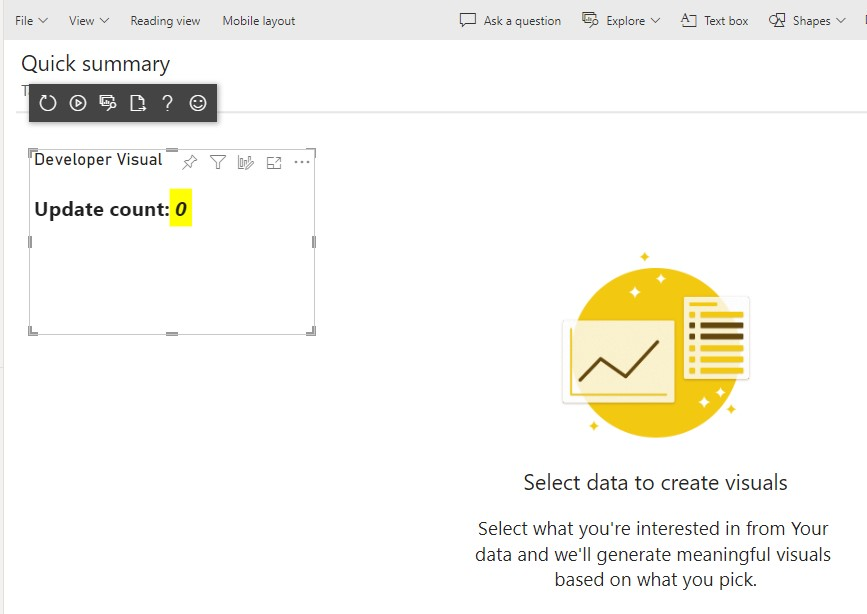

CircleCard visual tutorial complete (with sample Power BI data).

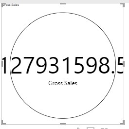

### Understanding Data Mappings

https://docs.microsoft.com/en-us/power-bi/developer/visuals/dataview-mappings

### Prototype of the front end DOM (blog)

Initial positionings of elements in a web page and in ts.

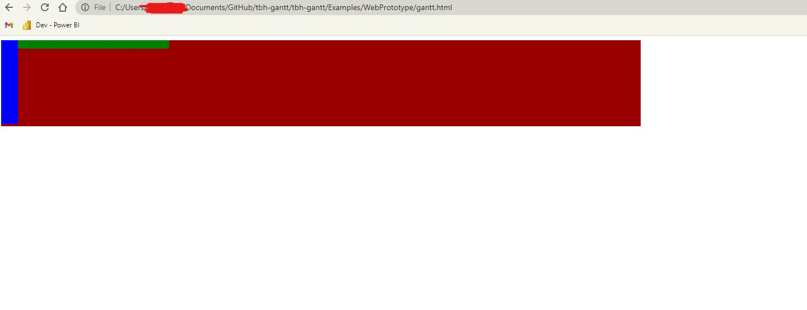
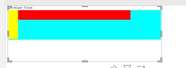
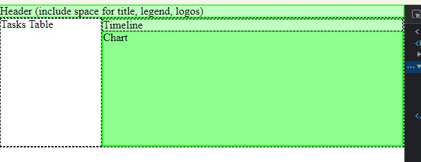
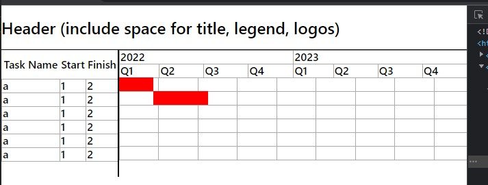
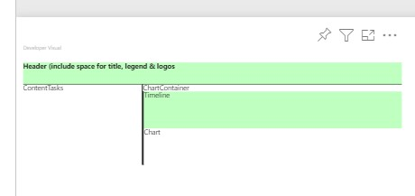

After the first iteration, it is proposed to use the following layout for overflow-y scrolling and dynamic sizing of the tasks table. Scrolling-x should not be allowed because we would be moving svgs around and dynamically rendering new lines and bars etc. Use other controls instead.

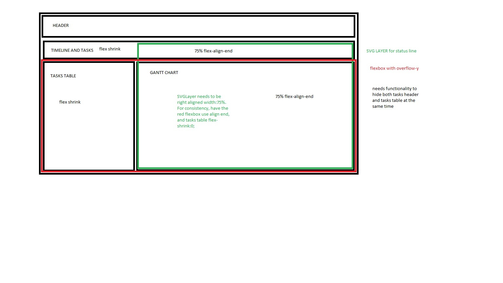

Arrays can now be mapped to tables using d3. The next steps are to manage the structured flow of data so we can use the activity properties to format the svgs.

Also, how do we take in data without having to transpose `myData` since we want to take in a column of actNames, a column of starts etc?

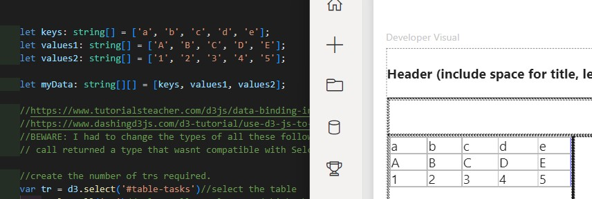

SVGs are now rendered in the visual using dummy data. An initial setup has been made to read in the css variables for the svg format. More string manipulation is required since the css vars come out with units attached. d3 multi select shoule be used to format all bars. Todo.

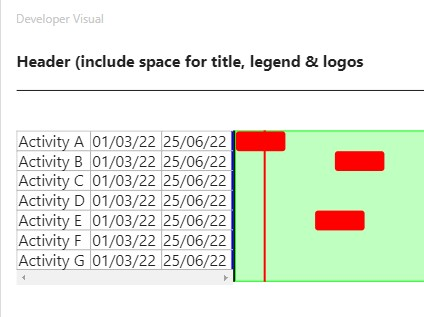


We use `Day.js` for time manipulation and working with days.

`YearSeparator` and `MonthSeparator`s are generated from a `Timeline`.

Note: there is a 1px misalignment in YearSeparator right now. Still need to debug.

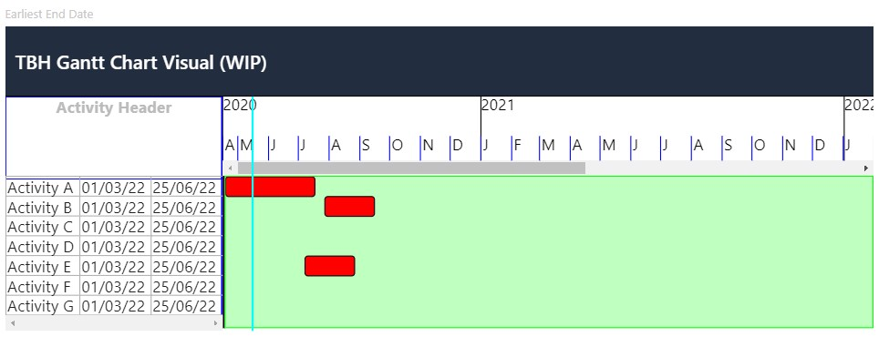

Timeline and chart now scroll synchronously. Added support for converting dates into positions on the timeline. It now seems that we need some css and div restructuring before continuing. We need to simplify the statusline-timeline-chart interactions, fix scrollbars, and account for an arbitrary number of activities in the activity table. Also we need to eventually refactor the word "tasks" out and replace it with "activity".

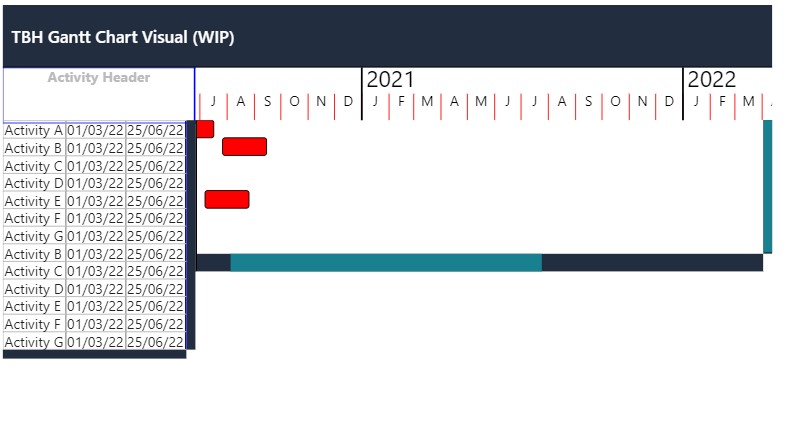

New div layout:

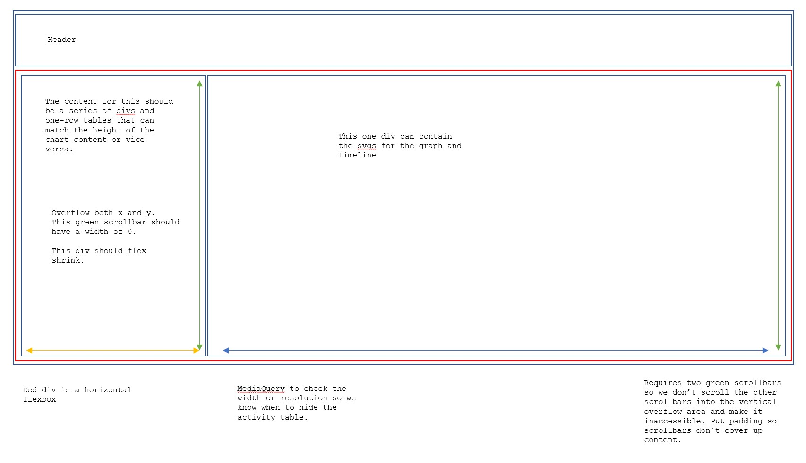

The `enter().append()` method chain can be replaced by `join()` to handle updating without replacement or duplicatio of elements. Details below.

https://programmer.group/the-concept-of-enter-exit-and-update-in-d3.html#:~:text=d3%20is%20based%20on%20the,or%20less%20elements%20than%20data.
https://observablehq.com/@d3/selection-join
https://observablehq.com/@d3/general-update-pattern
https://stackoverflow.com/questions/14422198/how-do-i-remove-all-children-elements-from-a-node-and-then-apply-them-again-with

## Requirements Definition

### Primary

- Timeline (at top by default, axis units YYYY and MMM by default)
- Timeline scaleable (zoom in or out)
- Activities (bar, blue by default) and Milestones (diamond, black by default)
- Summaries?
- Links between activities and milestones
- Critical activities identified as red (pull in total float)
- Status date line

### Secondary

- Mobile compatible
- Display multiple activities on one line (like rollup summaries)

### Features

- Expand / Collapse summaries
- [Optional] Timeline position options (bottom of gantt)
- [Optional] Timeline axis units adjustable

## Mockups / Layouts

## Procedure 2 - Adding a Measure Field (v0.2)

### Aim

This procedure aims to document all steps required to add a new measure field into the matrix dataRole in the `capabilities.json` file. In this case, we want to add a `Baseline Start` date field and a `Baseline Finish` date field.

### 1. Capabilities File

Add the following objects to the `dataRoles` array in the `capabilities.json` file.

```
{
    "name": "Baseline Start",
    "displayName": "Baseline Start",
    "displayNameKey": "Visual_Values",
    "kind": "Measure"
},
{
    "name": "Baseline Finish",
    "displayName": "Baseline Finish",
    "displayNameKey": "Visual_Values",
    "kind": "Measure"
}
```

### 2. Setting up the Configuration and Activity structure

#### configuration.ts

First, add an enumerated value to the enum `ValueFields`.

```
export enum ValueFields {
    START = 'Start',
    END = 'Finish',
    ISMILESTONE = 'IsMilestone',
    ISCRITICAL = 'IsCritical',
    STATUSDATE = 'StatusDate',
    BASELINESTART = 'BaselineStart',  //add
    BASELINEFINISH = 'BaselineFinish' //add
}
```

Next, extend the list of member variables and extend the member functions to ensure that the new enum is processed properly.

##### Member Variables and constructor()
Add a boolean member variable to represent if the new buckets (`baselineStart` and `baselineFinish`) contain a valid field.

```
export class Configuration {

    private verbose = false;

    private bool_start: boolean; //start      
    private bool_end: boolean; //end        
    private bool_isMilestone: boolean; //isMilestone
    private bool_isCritical: boolean; //isCritical 
    private bool_statusDate: boolean; //statusDate 
    private bool_baselineStart: boolean; //baselineStart    <-------- add
    private bool_baselineFinish: boolean; //baselineFinish  <-------- add

    private valueMap: Map<ValueFields, number>;

    private vs: powerbi.DataViewMetadataColumn[];

    //...
}
```

Ensure to initialise the variable to `false` in the `constructor()`.

##### field()
This function can check or set the bool_* members of the Configuration object through switch statements. Ensure the new cases are evaluated.

##### Support functions

Add the new ValueFields and variables to other support functions within `configuration.ts`. Eg. `printConfig()`, `valueRoles()`, `configurationBooleans()`